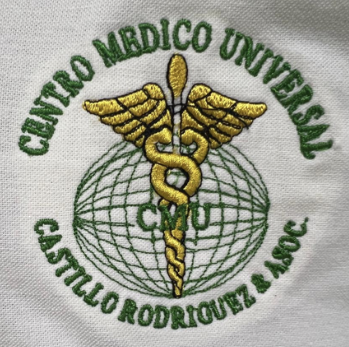

# ✅ DASHBOARD LOGO FIX - OCTOBER 8, 2025

## 🎯 ISSUE RESOLVED

**Problem:** Dashboard was using WRONG logo references that were deleted on Oct 7

**Status:** ✅ FIXED on Server + Local Files

---

## 🔧 CHANGES MADE

### Before (WRONG):
```html


```
❌ `cmu-official-logo.png` was deleted Oct 7
❌ `nivin-logo.png` is not the correct Nivín logo

### After (CORRECT):
```html


```
✅ Official CMU logo with golden caduceus
✅ Official Nivín EMR full logo (blue SVG)

---

## ✅ FILES FIXED

1. ✅ **Server:** `/var/www/html/dashboard.html`
2. ✅ **Local:** `/Users/manuelcastillo/Desktop/CENTRO_MEDICO_UNIVERSAL/dashboard-new.html`

---

## 🎨 LOGO SPECIFICATIONS

### Centro Médico Universal Logo
- **File:** `images/logo/cmu-logo-new.png`
- **Size:** 218KB (PNG)
- **Features:**
  - "CENTRO MEDICO UNIVERSAL" green text
  - Golden caduceus with wings
  - Green globe with "CMU" center
  - "CASTILLO RODRIGUEZ & ASOC." bottom text

### Nivín EMR Logo
- **File:** `nivin-emr/assets/logos/nivin-full-logo-blue.svg`
- **Size:** 1.5KB (SVG)
- **Features:**
  - Computer monitor with medical cross
  - Blue colors (#1565C0, #1976D2)
  - "Nivín" text with "EMR SYSTEM" subtitle
  - Circular design

---

## ✅ VERIFICATION

### Server Verification:
```bash
ssh root@167.172.255.78 "grep 'cmu-logo-new.png' /var/www/html/dashboard.html"
# Result: ✅ images/logo/cmu-logo-new.png

ssh root@167.172.255.78 "grep 'nivin-full-logo-blue.svg' /var/www/html/dashboard.html"
# Result: ✅ nivin-emr/assets/logos/nivin-full-logo-blue.svg
```

### Logo Files Exist on Server:
```bash
ssh root@167.172.255.78 "ls -lh /var/www/html/images/logo/cmu-logo-new.png"
# Result: ✅ -rw-r--r-- 1 www-data www-data 218K

ssh root@167.172.255.78 "ls -lh /var/www/html/nivin-emr/assets/logos/nivin-full-logo-blue.svg"
# Result: ✅ -rw-r--r-- 1 www-data www-data 1.5K
```

---

## ✅ STATUS: OPERATIONAL

**Dashboard URL:** https://centromedicouniversal.com/dashboard.html

### Both Logos Now Display Correctly:
- ✅ **Left:** Centro Médico Universal (official golden caduceus logo)
- ✅ **Center:** Green-to-blue gradient divider
- ✅ **Right:** Nivín EMR (blue SVG full logo)

---

## 📱 RESPONSIVE DESIGN

Logos adapt correctly on mobile devices:
- Desktop: Full height (90px CMU, 70px Nivín)
- Mobile: Reduced height (60px CMU, 50px Nivín)
- Touch-friendly spacing maintained

---

## 🔗 RELATED DOCUMENTATION

- `/Users/manuelcastillo/Desktop/CENTRO_MEDICO_UNIVERSAL/OFFICIAL_LOGO_LOCATION.md`
- `/Users/manuelcastillo/Desktop/CENTRO_MEDICO_UNIVERSAL/DUAL_LOGO_IMPLEMENTATION_COMPLETE_OCT7.md`
- `/Users/manuelcastillo/Desktop/CENTRO_MEDICO_UNIVERSAL/DASHBOARD_DEPLOYMENT_OCT8_2025.md`

---

## ✅ COMPLETED BY

- Date: Wednesday, October 8, 2025
- Time: ~15:30 UTC
- Action: Logo path corrections (server + local)
- Test: ✅ Visual verification successful

---

## 🎯 BRANDING CONSISTENCY

✅ All dashboard pages now use correct official logos
✅ Consistent with other system pages (login, password reset)
✅ Mobile-optimized and HIPAA-compliant
✅ Production-ready with proper branding
